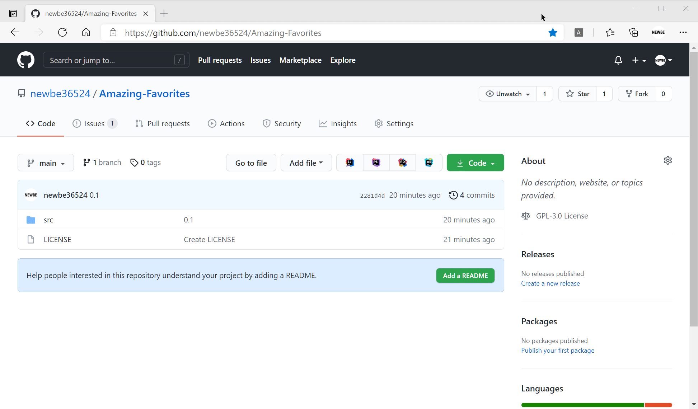

# Amazing Favorites

Amazing Favorites help you to manage you bookmarks efficiently.

Please feel free to add your idea to issues.

You can find the user manual at [af.newbe.pro](https://af.newbe.pro/docs/)

You can install this extension from stores below:

- [Microsoft Edge Store](https://microsoftedge.microsoft.com/addons/detail/amazing-favorites/bknjgbpkaloajcphccpcnahegfglfiei)
- [Chrome Store](https://chrome.google.com/webstore/detail/amazing-favorites/podhpclhgkdeiechkdceginfehfanhcb)

## Screenshots

### Add a new page as bookmark

### Amazing Favorites Manager

## Install from source

1. [download and install .net 6 sdk](https://dotnet.microsoft.com/download/dotnet/6.0)
2. run `dotnet build` in `src` folder to build extensions
3. open your browser (Chrome / Microsoft Edge / 360 browser / Vivaldi or else) to enable `extension developer mode`
4. load extension from folder `src/Newbe.BookmarkManager/bin/Debug/net6.0/browserextension`
5. enjoy now!

## Links

- [Ant Design Blazor Documentation](https://ant-design-blazor.github.io)
- [Official Blazor Documentation](https://docs.microsoft.com/en-us/aspnet/core/blazor/?WT.mc_id=DT-MVP-5003987)
- [MS Learn for Blazor Tutorial](https://docs.microsoft.com/en-us/learn/modules/build-blazor-webassembly-visual-studio-code/?WT.mc_id=DT-MVP-5003987)
- [Blazor Extensions for build a browser extensions](https://github.com/mingyaulee/Blazor.BrowserExtension)
